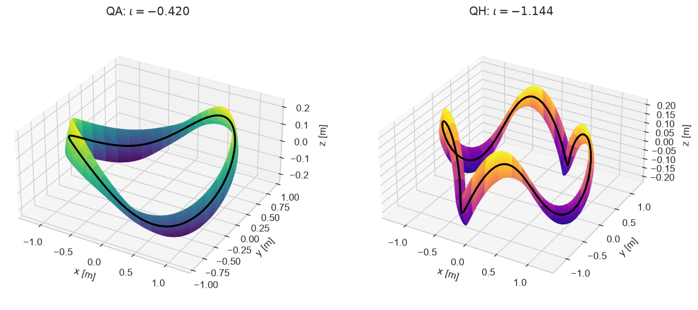
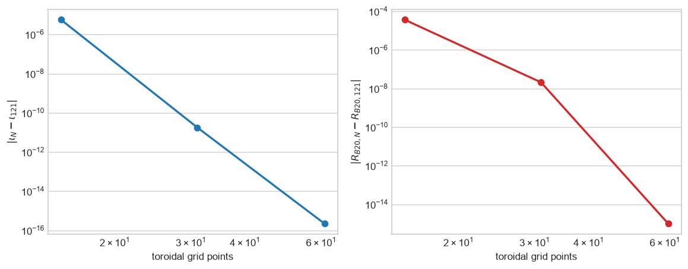

# pyQSC_JAX

Differentiable near-axis stellarator construction and surface-free
plasma–coil field jets in JAX.

[](https://github.com/uwplasma/pyQSC_JAX/actions/workflows/tests.yml)
[](https://codecov.io/gh/uwplasma/pyQSC_JAX)
[](https://pypi.org/project/pyqsc-jax/)
[](https://pyqsc-jax.readthedocs.io/)
[](docs/release_checklist.md)
[](LICENSE)

> **Status:** development branch for the 0.2 refactor. The physics,
> compatibility, and external 3+5+7 field-jet paths are validated; release
> hardening is still in progress.

| QA and QH near-axis surfaces | Exact affine \(B_{2c}\) elimination |
| --- | --- |
|  |  |

| Total/plasma/external field jet | Spectral convergence |
| --- | --- |
|  |  |

## Install

```bash
python -m pip install pyqsc-jax
```

Install the JAX build appropriate for your CPU or accelerator. pyQSC_JAX does
not configure a backend or enable 64-bit mode at import time.

## Quickstart

```python
import pyqsc_jax as qsc

solution = qsc.Qsc(
    rc=[1.0, 0.155, 0.0102],
    zs=[0.0, 0.154, 0.0111],
    nfp=2,
    etabar=0.64,
    B2c=-0.00322,
    nphi=61,
    order="r2",
)

assert solution.root_report.converged
assert solution.linear_report.converged
print("iota:", solution.iota)
print("B20 residual:", solution.B20_residual)
print("Mercier D r^2:", solution.DMerc_times_r2)
print("singular radius:", solution.r_singularity)
print("minimum L_grad_grad_B:", solution.L_grad_grad_B.min())
```

The result is an immutable JAX pytree. Canonical field arrays use
sample-first ordering: `(nphi, 3)`, `(nphi, 3, 3)`, and
`(nphi, 3, 3, 3)`.

## Capabilities

| Capability | Status |
| --- | --- |
| General Fourier axes, QA/QH topology, spectral Frenet geometry | Validated |
| Converged periodic sigma solve with implicit JVP/VJP | Validated |
| Complete finite-pressure/current r2 and total field Hessian | Validated |
| r3 boundary correction and magnetic shear | Validated documented specialization |
| Mercier, singular radius, scale lengths, \(B_{20}\) spectrum | Validated |
| Target-\(\iota\) inverse solve and pseudo-arclength folds | Validated |
| Exact \(B_{2c}\), criteria, bounded multistart axis search | Validated |
| Surface-free plasma field, gradient, Hessian | Validated asymptotic model |
| External vacuum 3+5+7 field-jet target | Validated |
| ESSOS vacuum/finite-beta stage-two and single-stage objectives | Draft integration PR |
| Legacy `pyqsc_jax.near_axis.near_axis` contract | Preserved |

## Target rotational transform

```python
axis = qsc.Axis(rc=[1.0, 0.045], zs=[0.0, -0.045], nfp=3)
inverse = qsc.solve(
    axis=axis,
    iota=0.42,
    etabar=-1.0,
    solve_for="etabar",
)
print(inverse.inputs.etabar, inverse.response_derivative, inverse.branch_fold)
```

The `etabar` sign and seed select a local branch. Use
`continue_etabar_branch` when the response approaches a fold.

## Axis optimization

```python
indices = qsc.stellarator_symmetric_variable_indices(axis, modes=(1,))
problem = qsc.AxisSearchProblem(
    axis=axis,
    variable_indices=indices,
    lower_bounds=[0.02, -0.08],
    upper_bounds=[0.08, -0.02],
    etabar=-0.9,
)
result = qsc.search_axis(problem)
print(result.status, result.search_budget, result.distinct_basins)
```

Only `verified_zero` certifies the known zero lower bound of the nonnegative
primary \(B_{20}\) residual. A nonzero result is `best_found`, never a
mathematical global-minimum claim.

## Finite-beta coil targets

```python
solution = qsc.solve_configuration("finite_pressure_current", nphi=61)
target = qsc.plasma_hessian_on_axis(solution, formal_radius=0.025)

print(target.field.external_field.shape)                 # (nphi, 3)
print(target.field.external_gradient_independent.shape) # (nphi, 5)
print(target.external_hessian_independent.shape)         # (nphi, 7)
```

ESSOS consumes these external vacuum targets for normalized field, gradient,
and Hessian coil objectives. The dependency remains one-way:
`ESSOS -> pyQSC_JAX`.

## Learn and validate

- [Installation and model selection](docs/getting_started/)
- [Theory and conventions](docs/theory/)
- [Executable tutorials](docs/tutorials/)
- [API reference](docs/api/)
- [pyQSC, literature, plasma, and ESSOS validation](docs/validation/)
- [Migration from pyQSC and the legacy adapter](docs/migration.md)
- [Known limitations](docs/advanced/limitations.md)

The [draft pyQSC_JAX PR](https://github.com/uwplasma/pyQSC_JAX/pull/2) and
[draft ESSOS integration PR](https://github.com/uwplasma/ESSOS/pull/46)
record the active review state.

## Citation and license

Citation metadata is in [CITATION.cff](CITATION.cff). A Zenodo DOI will be
minted as part of the first reviewed release; the badge remains explicitly
pending until then. pyQSC_JAX is MIT licensed. Adapted pyQSC source and
reference data retain BSD-2-Clause attribution in [NOTICE](NOTICE).
