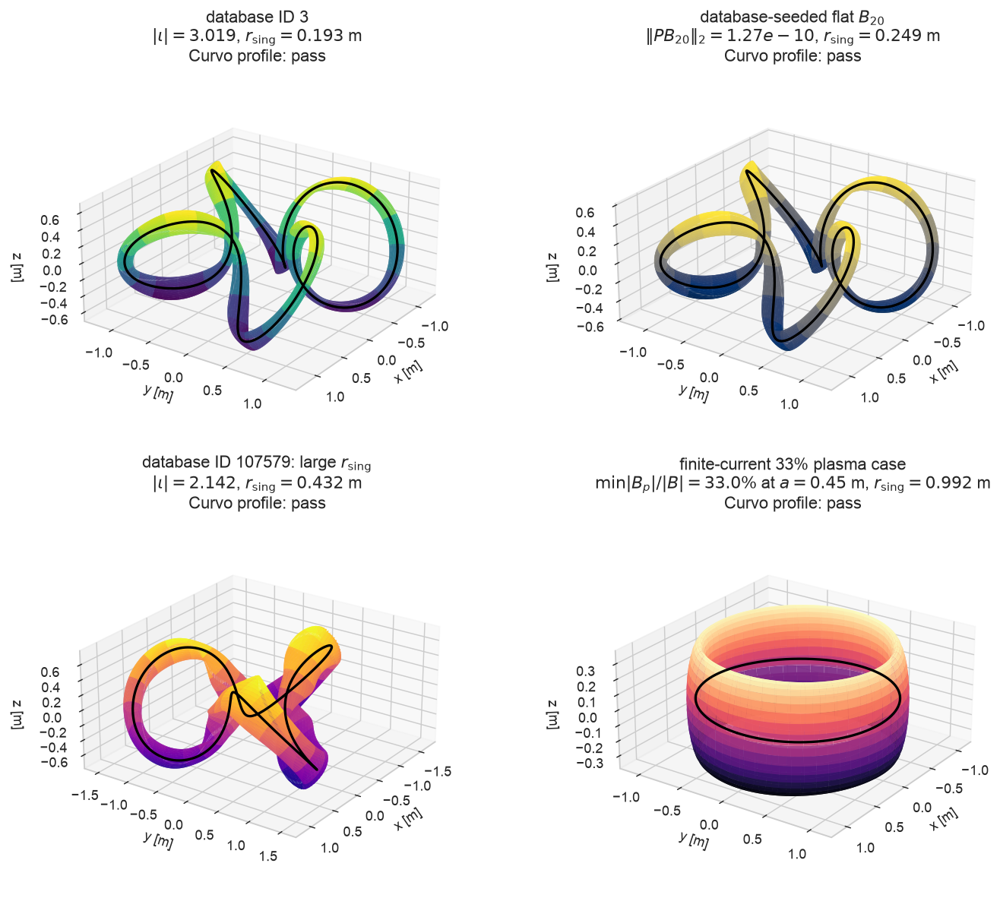
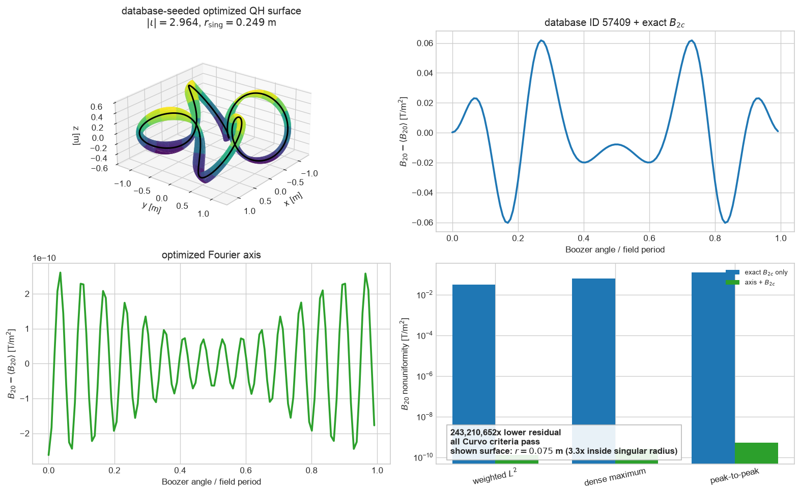
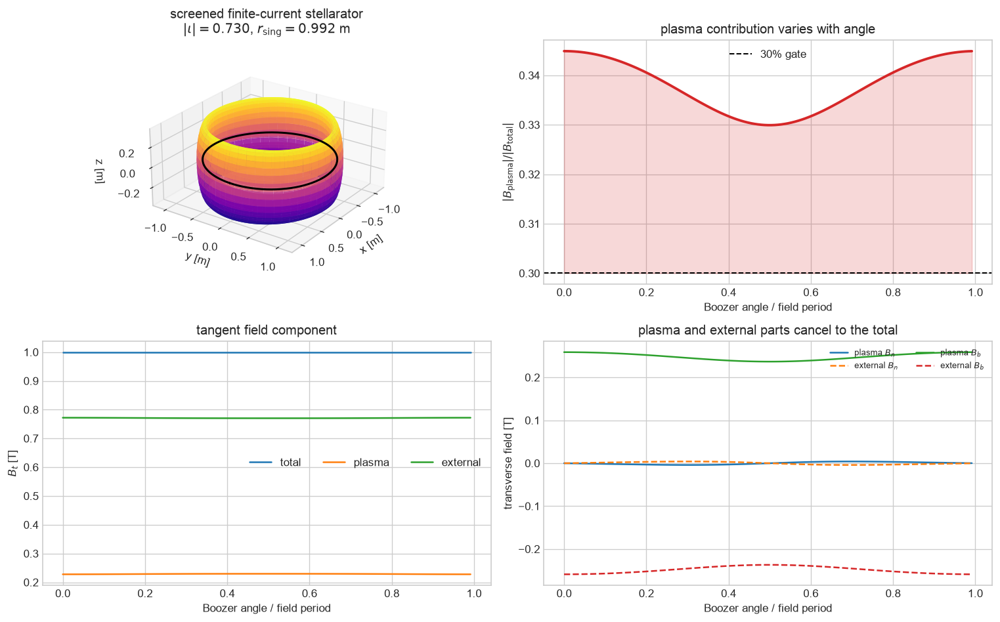
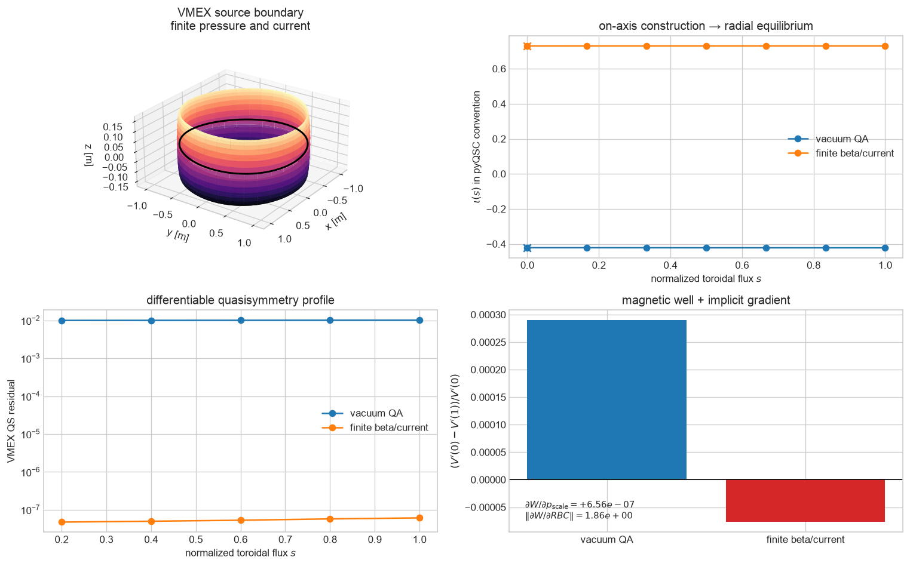
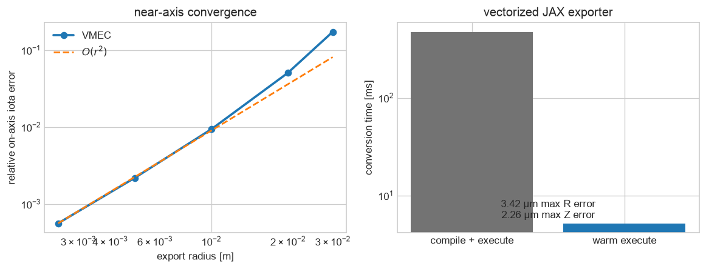

# pyQSC_JAX

Differentiable near-axis stellarator construction and surface-free
plasma–coil field jets in JAX.

[](https://github.com/uwplasma/pyQSC_JAX/actions/workflows/tests.yml)
[](https://codecov.io/gh/uwplasma/pyQSC_JAX)
[](https://pypi.org/project/pyqsc-jax/)
[](https://pyqsc-jax.readthedocs.io/)
[](docs/release_checklist.md)
[](LICENSE)

> **Status:** development branch for the 0.2 refactor. The physics,
> compatibility, and external 3+5+7 field-jet paths are validated; release
> hardening is still in progress.



Four runnable, independently re-evaluated designs: [database ID 3](https://stellarator.physics.wisc.edu/app/plot/3),
an eight-mode refinement of [database ID 57409](https://stellarator.physics.wisc.edu/app/plot/57409),
the large-clearance [database ID 107579](https://stellarator.physics.wisc.edu/app/plot/107579),
and an angle-dependent finite-current case. Every displayed design passes the
configurable Curvo/Table-3 profile with the stricter
\(\lvert\iota\rvert\geq0.4\); each panel reports transform, singular radius,
and its defining diagnostic. Plotting radii and database provenance are in
the adjacent JSON metadata.

| \(B_{20}\) optimization, geometry, and singular margin | Angle-dependent plasma/external field |
| --- | --- |
|  |  |

| Differentiable radial VMEX quantities | VMEC2000 export validation |
| --- | --- |
|  |  |

## Install

```bash
python -m pip install pyqsc-jax
```

Install the JAX build appropriate for your CPU or accelerator. pyQSC_JAX does
not configure a backend or enable 64-bit mode at import time.

For 3D plots and differentiable finite-radius equilibria:

```bash
python -m pip install 'pyqsc-jax[plot,vmex]'
```

## Quickstart

```python
import pyqsc_jax as qsc

configuration = qsc.get_configuration("database_example_3")
solution = configuration.solve(nphi=81)
criteria = qsc.Criteria.from_curvo_2025(minimum_abs_iota=0.4)

assert solution.root_report.converged
assert solution.linear_report.converged
assert criteria.evaluate(solution).passed
print("source:", configuration.source_url)
print("|iota|:", abs(solution.iota))
print("B20 residual:", solution.B20_residual)
print("Mercier D r^2:", solution.DMerc_times_r2)
print("singular radius:", solution.r_singularity)
print("minimum L_grad_grad_B:", solution.L_grad_grad_B.min())
```

The result is an immutable JAX pytree. Canonical field arrays use
sample-first ordering: `(nphi, 3)`, `(nphi, 3, 3)`, and
`(nphi, 3, 3, 3)`.

## Pick a workflow

| Goal | Start here | Main result |
| --- | --- | --- |
| Construct QA/QH near the axis | `qsc.Qsc(...)` | immutable near-axis solution |
| Flatten \(B_{20}\) | `optimize_B2c`, `search_axis` | verified dense-grid diagnostics |
| Inspect a full 3D surface | `plot_surface_3d` | figure plus explicit plotting radius |
| Compute radial MHD quantities | `to_vmex_problem(...).solve()` | differentiable \(\iota(s)\), QS profile, magnetic well |
| Match finite-beta coils | `plasma_hessian_on_axis` | external vacuum 3+5+7 target |
| Run conventional VMEC2000 | `to_vmec` | diagnosed `input.*` file |

## Capabilities

| Capability | Status |
| --- | --- |
| General Fourier axes, QA/QH topology, spectral Frenet geometry | Validated |
| Converged periodic sigma solve with implicit JVP/VJP | Validated |
| Complete finite-pressure/current r2 and total field Hessian | Validated |
| r3 boundary correction and magnetic shear | Validated documented specialization |
| Mercier, singular radius, scale lengths, \(B_{20}\) spectrum | Validated |
| Target-\(\iota\) inverse solve and pseudo-arclength folds | Validated |
| Exact \(B_{2c}\), criteria, bounded multistart axis search | Validated |
| Surface-free plasma field, gradient, Hessian | Validated asymptotic model |
| External vacuum 3+5+7 field-jet target | Validated |
| Fast fixed-boundary VMEC export, including asymmetric boundaries | Validated against VMEC 9.0 |
| Differentiable VMEX radial iota, QS profile, magnetic well | Validated in vacuum and finite beta |
| ESSOS vacuum/finite-beta stage-two and single-stage objectives | Draft integration PR |
| Legacy `pyqsc_jax.near_axis.near_axis` contract | Preserved |

## Headline regression cases

These are checked results, not illustrative targets. The detailed optimizer,
resolution, timing, and radius-convergence tables are in the
[B20](docs/theory/b20-optimization.md),
[plasma-field](docs/validation/plasma_field.md), and
[VMEC](docs/validation/vmec.md) validation pages.

| Check | Result | Regression gate |
| --- | ---: | ---: |
| Database-seeded QH \(B_{20}\), weighted \(L^2\), `nphi=121` | \(1.2743\times10^{-10}\) | \(<1.4\times10^{-10}\) |
| Improvement over ID-57409 exact-\(B_{2c}\) solve | \(2.4321\times10^8\)× | \(>2.0\times10^8\)× |
| \(B_{20}\)-optimized singular radius | 0.249 m | displayed \(r=0.075\) m gives 3.3× clearance |
| Largest showcased singular radius, database ID 107579 | 0.432 m | \(>0.4\) m |
| Four-case showcase design screen | all pass | Curvo profile with \(\lvert\iota\rvert\ge0.4\) |
| Angle-dependent minimum \(\lvert B_\mathrm{plasma}\rvert/\lvert B_\mathrm{total}\rvert\) | 32.99% at \(a=0.45\) m | \(>30\%\) |
| Plasma-field norm peak-to-peak / mean | 4.43% | \(>3\%\) |
| VMEC/near-axis on-axis \(\iota\), \(r=0.0025\) | 0.418543 / 0.418307 | relative error \(<0.1\%\) |
| VMEC force residuals | \(2.4\)–\(7.6\times10^{-11}\) | maximum \(<10^{-9}\) |
| `to_vmec`, Apple M4 CPU, compile+execute / warm | 0.476 s / 5.20 ms | warm unit gate \(<0.5\) s |

```python
optimized = qsc.solve_configuration("b20_optimized_good", nphi=121)
diagnostics = qsc.b20_diagnostics(optimized)
print(diagnostics.weighted_l2, diagnostics.grid_maximum)

plasma_case = qsc.solve_configuration("plasma_stellarator", nphi=61)
plasma = qsc.plasma_field_on_axis(plasma_case, formal_radius=0.45)
```

## Target rotational transform

```python
axis = qsc.Axis(rc=[1.0, 0.045], zs=[0.0, -0.045], nfp=3)
inverse = qsc.solve(
    axis=axis,
    iota=0.42,
    etabar=-1.0,
    solve_for="etabar",
)
print(inverse.inputs.etabar, inverse.response_derivative, inverse.branch_fold)
```

The `etabar` sign and seed select a local branch. Use
`continue_etabar_branch` when the response approaches a fold.

## Axis optimization

```python
indices = qsc.stellarator_symmetric_variable_indices(axis, modes=(1,))
problem = qsc.AxisSearchProblem(
    axis=axis,
    variable_indices=indices,
    lower_bounds=[0.02, -0.08],
    upper_bounds=[0.08, -0.02],
    etabar=-0.9,
)
result = qsc.search_axis(problem)
print(result.status, result.search_budget, result.distinct_basins)
```

Only `verified_zero` certifies the known zero lower bound of the nonnegative
primary \(B_{20}\) residual. A nonzero result is `best_found`, never a
mathematical global-minimum claim.

## The \(B_{20}\)-optimized stellarator in 3D

```python
from pyqsc_jax.plotting import plot_surface_3d

optimized = qsc.solve_configuration("b20_optimized_good", nphi=121)
figure, axis = plot_surface_3d(optimized, radius=0.075)

print(abs(optimized.iota))      # 2.9636
print(optimized.B20_residual)  # 1.2743e-10 T/m^2
print(optimized.r_singularity) # 0.249 m
```

This configuration is a staged eight-mode refinement of public database ID
57409, not an unconstrained toy optimum. It passes every named design
criterion with \(\lvert\iota\rvert=2.964\); the displayed surface is 3.3 times
inside the computed singular radius. The optimizer comparison,
Fourier-resolution audit, full coefficient set, provenance, and the
distinction between `best_found` and a certified zero are in the
[B20 optimization notes](docs/theory/b20-optimization.md).

## Finite-beta coil targets

```python
solution = qsc.solve_configuration("plasma_stellarator", nphi=61)
target = qsc.plasma_hessian_on_axis(solution, formal_radius=0.45)

print(target.field.external_field.shape)                 # (nphi, 3)
print(target.field.external_gradient_independent.shape) # (nphi, 5)
print(target.external_hessian_independent.shape)         # (nphi, 7)
```

ESSOS consumes these external vacuum targets for normalized field, gradient,
and Hessian coil objectives. The dependency remains one-way:
`ESSOS -> pyQSC_JAX`.

This case independently passes the Curvo profile with
\(\lvert\iota\rvert=0.730\) and \(r_\mathrm{sing}=0.992\) m. The stated
formal radius \(a=0.45\) m is mandatory model metadata and remains inside that
singular-radius estimate. The public plot uses Frenet components rather than
only \(|B|\), making the angle dependence and exact cancellation of plasma
and external transverse components visible;
\(|B_\mathrm{total}|=B_0\) is constant on axis by construction.

## Differentiable radial equilibria with VMEX

```python
import jax

near_axis = qsc.solve_configuration("plasma_stellarator", nphi=61)
problem = qsc.to_vmex_problem(
    near_axis,
    r=0.02,
    qs_surfaces=(0.25, 0.5, 0.75, 1.0),
)
equilibrium = problem.solve()

print(equilibrium.quantities.iota)          # full radial profile
print(equilibrium.quantities.quasisymmetry) # requested flux surfaces
print(equilibrium.quantities.magnetic_well)

well, gradient = jax.value_and_grad(
    lambda parameters: qsc.vmex_radial_quantities(
        problem, parameters
    ).magnetic_well
)(problem.parameters)
print(gradient.rbc, gradient.pres_scale)
```

`problem.parameters_for(new_near_axis_solution)` traceably rebuilds the
boundary, flux, pressure, and current leaves, allowing derivatives to
propagate from pyQSC_JAX variables through VMEX's converged fixed point.
Vacuum and scalar finite-beta fixed-boundary paths are tested against
[uwplasma/VMEX](https://github.com/uwplasma/vmex); the exact validated commit
and current limitations are recorded in the
[VMEX integration validation](docs/validation/vmex_interface.md).

## VMEC export

```python
solution = qsc.Qsc(
    rc=[1.0, 0.045],
    zs=[0.0, -0.045],
    nfp=3,
    etabar=-0.9,
    nphi=61,
    order="r2",
)
export = qsc.to_vmec(solution, "input.qa", r=0.005)
print(export.conversion_seconds)
print(export.boundary.maximum_R_reconstruction_error)
```

This small-radius QA input is a conversion-validation reference, not one of
the screened finite-beta showcase devices above. The exporter uses a
vectorized Newton inversion and a two-dimensional FFT,
supports all four VMEC boundary coefficient families, and returns conversion
diagnostics. The committed `wout` regression checks the resulting equilibrium,
including the on-axis transform; an opt-in test can rerun a local VMEC
executable.

## Learn and validate

- [Installation and model selection](docs/getting_started/)
- [Theory and conventions](docs/theory/)
- [Executable tutorials](docs/tutorials/)
- [API reference](docs/api/)
- [pyQSC, literature, plasma, and ESSOS validation](docs/validation/)
- [VMEC conversion, equilibrium, and performance validation](docs/validation/vmec.md)
- [Differentiable VMEX radial-equilibrium validation](docs/validation/vmex_interface.md)
- [Migration from pyQSC and the legacy adapter](docs/migration.md)
- [Known limitations](docs/advanced/limitations.md)

The [draft pyQSC_JAX PR](https://github.com/uwplasma/pyQSC_JAX/pull/2) and
[draft ESSOS integration PR](https://github.com/uwplasma/ESSOS/pull/46)
record the active review state.

## Citation and license

Citation metadata is in [CITATION.cff](CITATION.cff). A Zenodo DOI will be
minted as part of the first reviewed release; the badge remains explicitly
pending until then. pyQSC_JAX is MIT licensed. Adapted pyQSC source and
reference data retain BSD-2-Clause attribution in [NOTICE](NOTICE).
