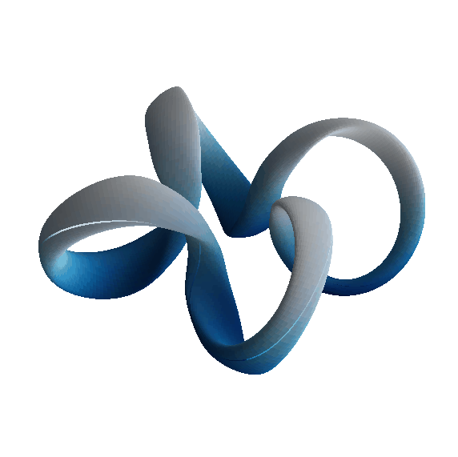
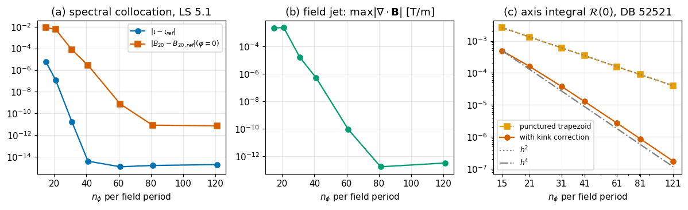
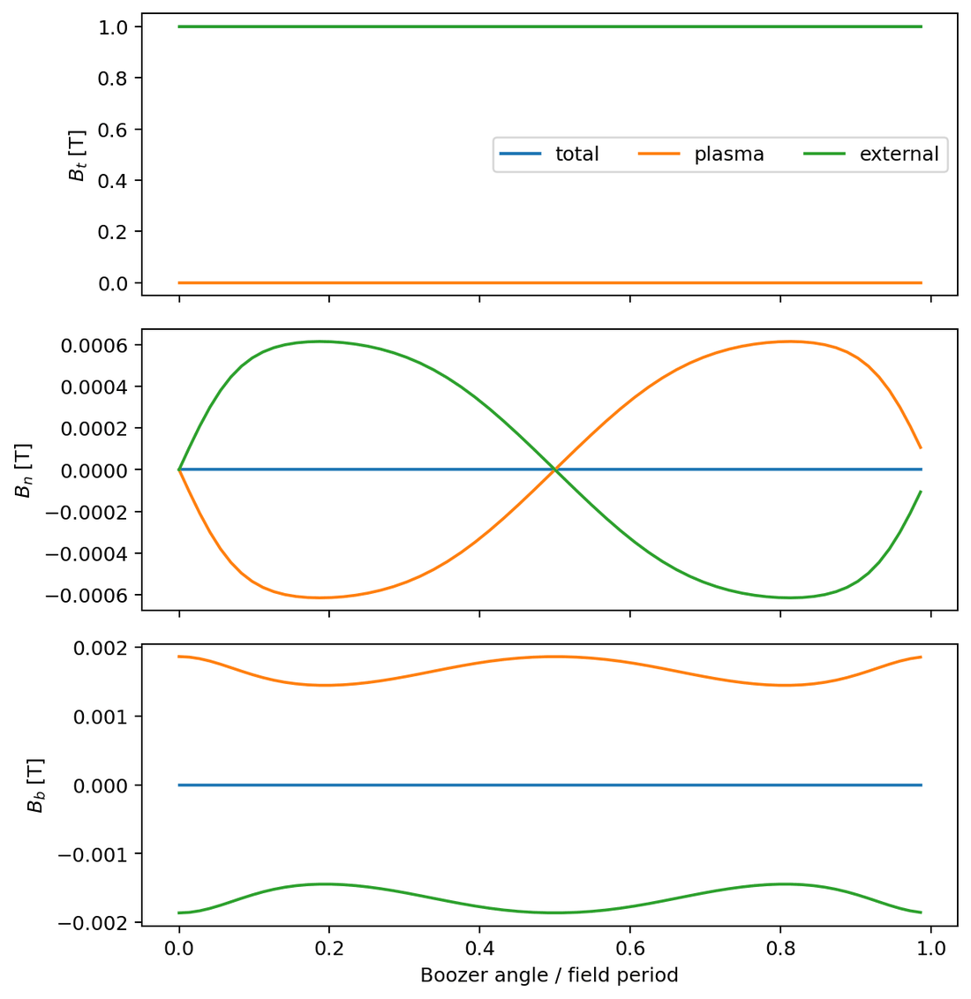
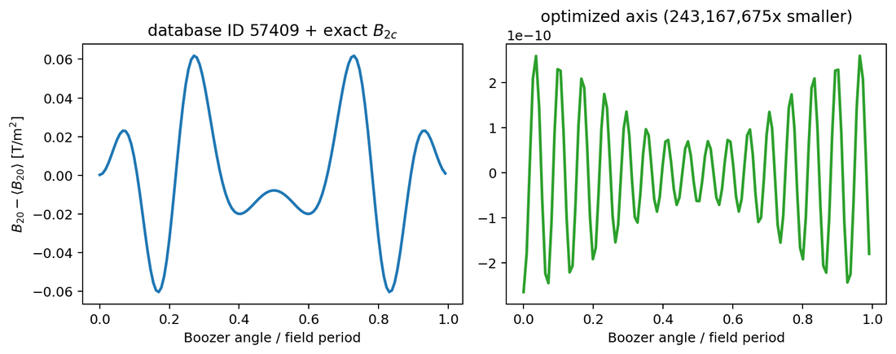
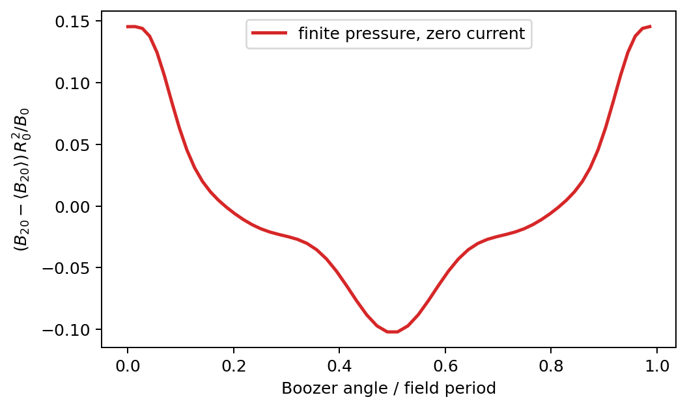
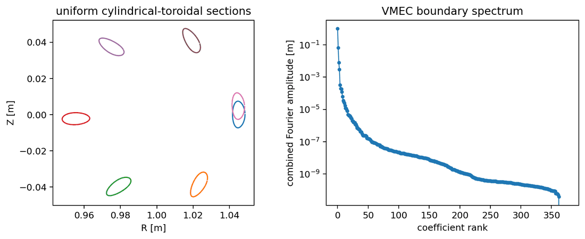

# pyQSC_JAX

[](https://github.com/uwplasma/pyQSC_JAX/actions/workflows/tests.yml)
[](https://pyqsc-jax.readthedocs.io/)
[](https://pypi.org/project/pyqsc-jax/)
[](LICENSE)

Differentiable near-axis construction of quasisymmetric stellarators in JAX.

pyQSC_JAX solves the Garren-Boozer near-axis equations for a given magnetic axis: the
first-order $\sigma$ equation for the rotational transform, the complete second-order
system at finite pressure and current, and the pyQSC-compatible third-order boundary
correction. It computes the on-axis field, gradient and Hessian, the singular radius,
Mercier terms and $B_{20}$ diagnostics, separates the plasma field from the external
(coil) field on the axis, and exports VMEC inputs or differentiable VMEX equilibria.
Solutions are immutable JAX pytrees; `solve` is jitted, and the implicit solves are
differentiated at the converged solution.

<p align="center">
  
</p>

## Install

```bash
python -m pip install pyqsc-jax            # add [plot] for Matplotlib, [vmex] for VMEX
```

JAX must run in 64-bit mode (`export JAX_ENABLE_X64=1`); the package does not change
JAX settings on import.

## Example

```python
import jax
jax.config.update("jax_enable_x64", True)
import pyqsc_jax as qsc

# Landreman & Sengupta (2019), section 5.1
solution = qsc.Qsc(rc=[1.0, 0.155, 0.0102], zs=[0.0, 0.154, 0.0111], nfp=2,
                   etabar=0.64, B2c=-0.00322, order="r2", nphi=61)
assert solution.root_report.converged and solution.linear_report.converged
print(solution.iota, solution.B20_variation, solution.r_singularity)

# gradient of the B20 variation with respect to etabar, through both implicit solves
grad = jax.grad(lambda e: qsc.solve(axis=solution.axis, etabar=e, B2c=-0.00322,
                                    order=2, nphi=61).B20_variation)(0.64)
```

## Results at a glance

All field quantities are relative to the on-axis field $B_0$ and the major radius $R_0$.

| | |
|---|---|
|  | Spectral convergence with axis resolution: (a) rotational transform and $B_{20}$ against pyQSC (Landreman & Sengupta 2019, section 5.1); (b) divergence of the field jet; (c) the regularized full-axis integral of the plasma field, fourth order with the endpoint kink correction, second order without. |
|  | The on-axis field split into the plasma field and the external (coil) field, in the Frenet frame (`examples/10_plasma_external_field_jet.py`). The coils must supply the external part, not the total. |
|  | Quasisymmetry at second order: $B_{20}$ variation of a database configuration and after axis optimization (`examples/06_optimize_axis_B20.py`). |
|  | Second order at finite pressure and zero current (`examples/03_second_order_finite_beta.py`). |
|  | VMEC boundary export: cross-sections on uniform cylindrical angle and the boundary Fourier spectrum (`examples/13_vmec_export.py`). |

## Documentation

<https://pyqsc-jax.readthedocs.io> has the theory (every equation and algorithm), a user
guide, one page per script in [`examples/`](examples), and the API. Validation studies and
publication figures are in
[plasma-coil-fields](https://github.com/rogeriojorge/plasma-coil-fields/tree/pyqsc-jax-validation/pyqsc_jax_validation).

pyQSC_JAX follows [pyQSC](https://github.com/landreman/pyQSC) by Matt Landreman and is
used by [ESSOS](https://github.com/uwplasma/ESSOS) for coil design. MIT licensed.
